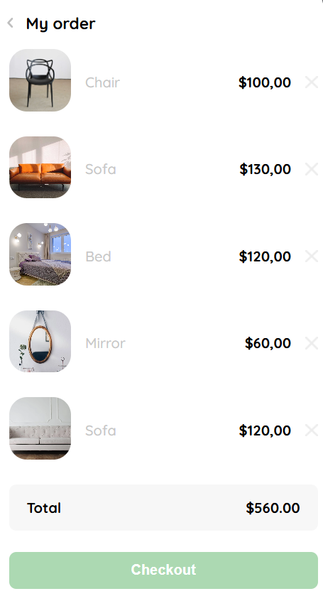
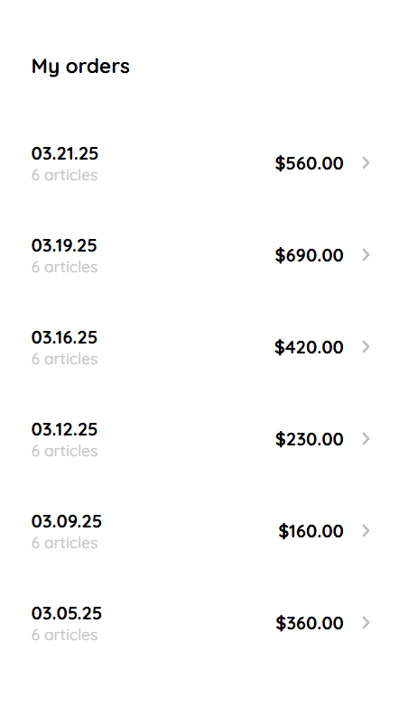
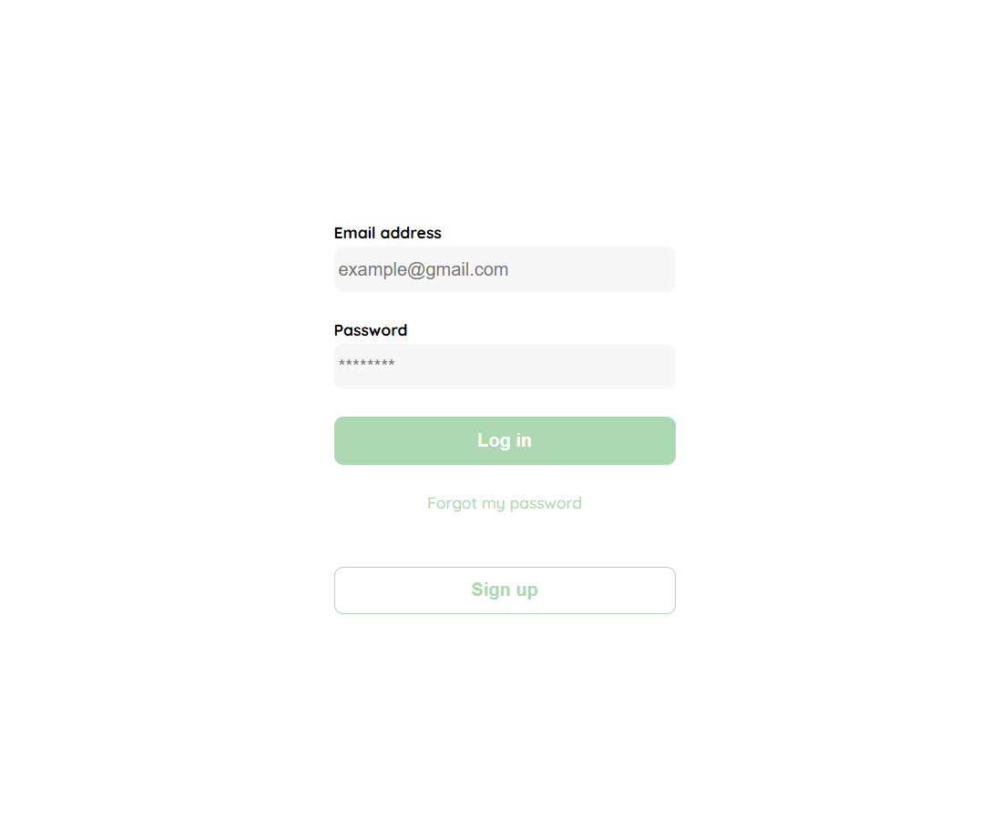
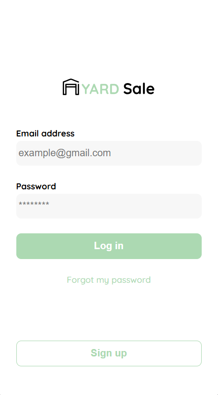
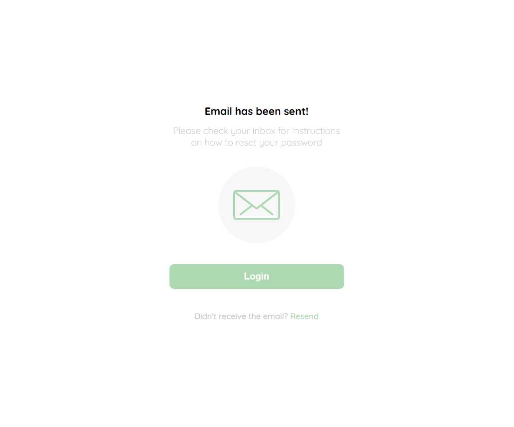
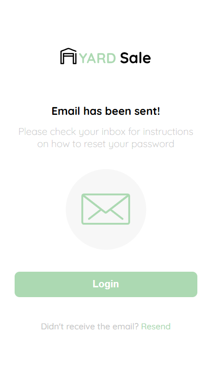

# Yard Sale Frontend

Este repositorio contiene el diseño y la maquetación en HTML y CSS de las pantallas de un proyecto web para una tienda en línea. Cada pantalla se encuentra en un archivo HTML independiente, con el objetivo de, en un futuro, convertirlos en componentes reutilizables en ReactJS.

- **Pantalla Homepage**  
   

## Características

- **Diseño Responsivo:** Todas las pantallas han sido diseñadas para adaptarse a múltiples dispositivos, ofreciendo una experiencia óptima tanto en escritorio como en móvil.
- **HTML y CSS Modulares:** Cada pantalla está separada en su propio archivo, facilitando la conversión a componentes en ReactJS y la gestión modular del proyecto.
- **Interfaz Profesional:** El proyecto cuenta con un diseño limpio e intuitivo, orientado a demostrar habilidades de frontend en entornos reales.

## Estructura del Repositorio

- **`index.html`**: Pantalla principal o de inicio.
- **`/src`Otros archivos HTML:** Cada uno representa una de las pantallas del proyecto.
- **`/screenshots` (opcional):** Carpeta para almacenar capturas de pantalla de cada interfaz, lo que permite visualizar rápidamente el aspecto renderizado de cada página.

## Screenshots

A continuación se listan algunas de las pantallas del proyecto:

1. **Pantalla de Detalle del Producto**  
   

2. **Pantalla Shopping Kart**  
   

3. **Pantalla My Order**  
   

4. **Pantalla My Orders**  
   

5. **Pantalla de Login (Desktop)**  
   

6. **Pantalla de Login (Mobile)**  
   

7. **Pantalla de Cambio de Contraseña (Desktop)**  
   

8. **Pantalla de Cambio de Contraseña (Mobile)**  
   

9. **Pantalla de Email (Desktop)**  
   

10. **Pantalla de Email (Mobile)**  
   
